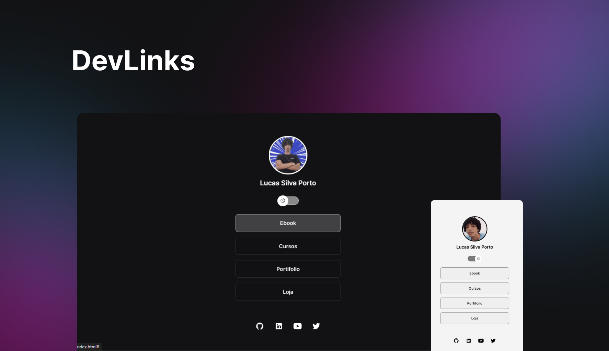

<h1 align="center">DevLinks</h1>

<a href="#projeto"> Projeto</a>
&nbsp;&nbsp;&nbsp;|&nbsp;&nbsp;&nbsp;
<a href="#-tecnologias"> Tecnologias</a>

## 🌎 Projeto

O DevLinks é um agregador de links para usar como cartão de visitas online. Desenvolvido com auxilio do curso discover da Rocketseat.

## 💻 Tecnologias

Esse projeto foi desenvolvido usando as tecnologias:

- HTML e CSS
- JavaScript
- git e Github
- ioicons
